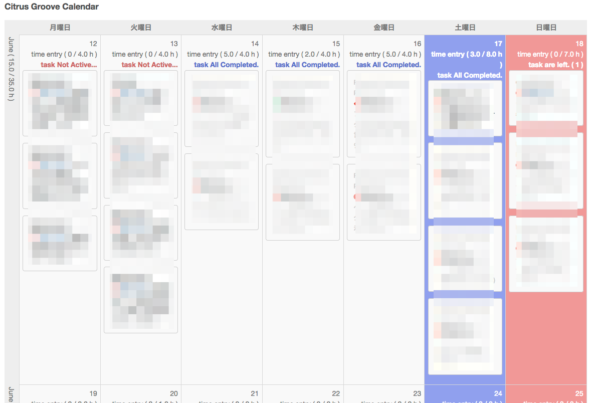
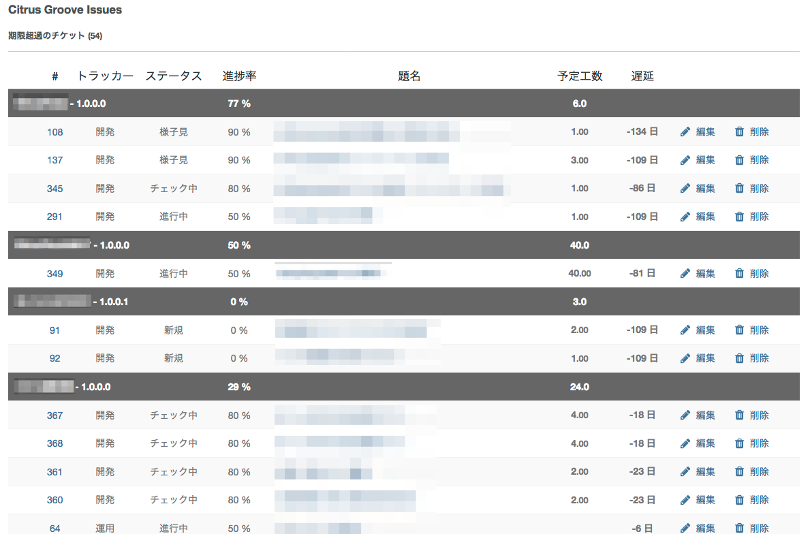

# redmine_citrus_my_page_tools

* This plugin is 'my page' extension for Redmine.  
(このプラグインはRedmineのマイページ拡張機能です。)

## Compatibility

* Redmine 3.3.3
* Ruby 2.3.4

I am checking the operation.  
(以上のバージョンで動作確認を行っています。)

## Installation

1. change directory

        cd {REDMINE_ROOT}/plugins

2. put plugin files

    * git clone

            git clone https://github.com/take64/redmine_citrus_my_page_tools.git redmine_citrus_my_page_tools

        or

            git clone git@github.com:take64/redmine_citrus_my_page_tools.git redmine_citrus_my_page_tools

    * zip unarchive

            wget https://github.com/take64/redmine_citrus_my_page_tools/archive/master.zip

3. Redmine restart

## Usage

### Citrus Groove Calendar

* Purpose

    * Look for tickets registered on the same date in multiple projects.  
    (複数プロジェクトで同じ日付に登録されているチケットが無いかを探す)

* Contents

    * 3 week calendar.  
    (本日を中心とした3週間分のカレンダー)

    * work hours and estimated hours display.  
    (予定工数と実績工数の表示)

* Preview

### Citrus Groove Issues

* Purpose

    * will find a ticket that has expired.  
    (有効期限が切れたチケットが見つかります。)

* Contents

    * over due ticket list.  
    (期限切れのチケットリスト)

    * today due ticket list.  
    (今日のチケットリスト)

    * future due ticket list.  
    (将来の予定チケットリスト)

* Preview

## License

* GNU General Public License, version 2 (GPLv2)

## Auther/Developer

**take64** (Citrus/besidesplus)
* Twitter: https://twitter.com/citrus_take64
* github: https://github.com/take64
* website: http://besidesplus.net/
